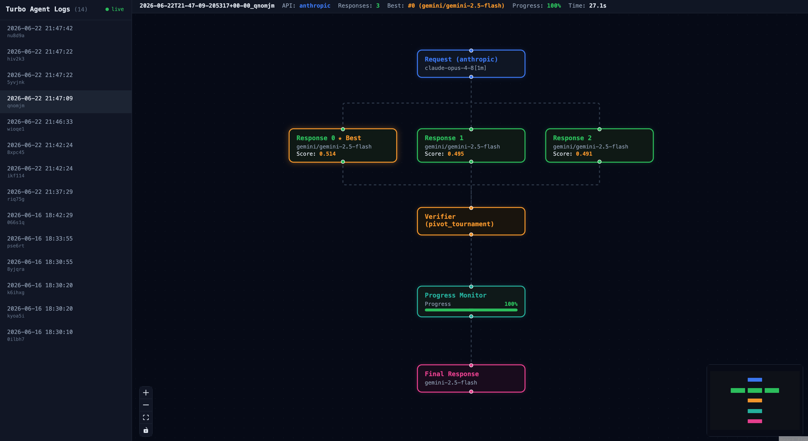

# Turbo Agent



Turbo Agent is the Claude Code plugin for LLM-as-a-Verifier. It implements an LLM API proxy that improves response quality through concurrent inference, verification, and refinement. It sits between your client (Claude Code, Codex, etc.) and the LLM provider, sending multiple parallel requests and selecting the best response with a **Probabilistic Pivot Tournament (PPT)** scored by a fine-grained logprob verifier.

```
Client request
    │
[Context Refinement]   (optional) rewrite/augment the system prompt for clarity
    │
[Concurrent Inference] send N parallel candidates to the backend model
    │
[Verification]         pivot tournament over the candidates, pick the best one
    │
Best response → Client
```

Verification uses the pivot tournament from the [`llm-verifier`](https://pypi.org/project/llm-verifier/) package to pick the best of `N` candidates.

## Install

```bash
pip install turbo-agent
```

Or from source:

```bash
pip install -e .
```

## Setup

For turbo agent to work, you need a `turbo-agent.yaml`. You can copy the reference file in this repo.

`turbo-agent.yaml` references keys with `$VAR_NAME` syntax. The recommended way to provide them is a `.env` file in the project root (next to `turbo-agent.yaml`) — the proxy loads it automatically on startup. Copy the committed template and fill in your keys:

```bash
cp .env.example .env
# then edit .env
```

```bash
# .env
VERTEX_API_KEY=your-vertex-key     # Vertex-backed Gemini verifier
# GEMINI_API_KEY=your-gemini-key     # Gemini Developer API backend or verifier
# OPENAI_API_KEY=...               # only if you route to openai/ models
# ANTHROPIC_API_KEY=...            # only if you route to anthropic/ models
```

`.env` is gitignored; `.env.example` is committed as the template. Keys already
exported in your shell environment work too and take nothing extra. The verifier
and progress monitor use Gemini **logprobs**, which are best served by a Vertex
AI key (`VERTEX_API_KEY` + `provider: vertex_ai` in the config); a plain
`GEMINI_API_KEY` also works for the `gemini/` backend models.

Verify your keys are valid:

```bash
turbo-agent check
```

It checks every supported provider (Gemini, Vertex AI, OpenAI, Anthropic) and reports each with ✅ / ❌ / ⚠️ / ⚪️, flagging which keys your config actually uses.

## Run

```bash
turbo-agent                   # default port 8888
turbo-agent -p 9000           # custom port
```

### Use with Claude Code

```bash
ANTHROPIC_BASE_URL=http://localhost:8888 claude
```

### Use with OpenAI-compatible clients

```bash
export OPENAI_API_BASE=http://localhost:8888/v1
```

## Configuration

Edit `turbo-agent.yaml`. API keys can reference environment variables with `$VAR_NAME` syntax. See the reference `turbo-agent.yaml` file for reference and usage.

### Model prefixes

| Prefix | Provider |
|--------|----------|
| `gemini/` | Google Gemini |
| `openai/` | OpenAI |
| `anthropic/` | Anthropic |
| `claude-cli/default` | Claude Code subscription CLI (text-only candidates) |
| `codex-cli/default` | Codex ChatGPT subscription CLI (text-only candidates) |
| (none) | OpenAI-compatible endpoint |

### Subscription CLI candidates

`claude-cli/default` and `codex-cli/default` generate candidates through the
installed first-party CLIs. They reject API keys, sampling controls, client
tool calls, logprobs, and direct streaming. Turbo Agent still creates parallel
candidates with `num_candidates`; each CLI invocation returns one text result.

The CLI subprocesses receive a default-deny environment containing only normal
runtime state and the selected CLI's subscription-auth surface. Claude runs in
plan mode with read/search tools, while Codex runs with an ephemeral read-only
sandbox and ignores user provider configuration.

```yaml
backend:
  models:
    - name: claude-cli/default
      num_candidates: 1
    - name: codex-cli/default
      num_candidates: 1

verifier:
  model:
    name: gemini/gemini-3.5-flash
    api_key: $GEMINI_API_KEY
  majority_voting: false
  require_logprobs: true
  method:
    name: pivot_tournament
    pivots: 1
    n_verifications: 1
    seed: 0
```

This configuration uses the Gemini Developer API for verifier logprobs; it
does not require Vertex AI. Candidate authentication must already be available
through Claude Code OAuth and `codex login` with ChatGPT.
`require_logprobs: true` rejects textual score fallbacks and records the actual
validated verifier-call count in each request log.

## API endpoints

| Endpoint | Format |
|----------|--------|
| `POST /v1/messages` | Anthropic |
| `POST /v1/chat/completions` | OpenAI |
| `GET /v1/models` | OpenAI |
| `GET /visualizer` | Pipeline visualizer UI |
| `*` | Upstream passthrough to api.anthropic.com |

## Visualizer

A built-in web UI at `http://localhost:8888/visualizer` shows the pipeline DAG for each request — context refinement, all candidate responses, the pairwise tournament comparisons and scores, and the final selection.

To build the frontend (requires Node.js):

```bash
cd frontend
yarn install
yarn build
```

## Publish to PyPI

```bash
cd frontend && yarn build && cd ..
pip install build twine
rm -rf dist
python -m build
twine check dist/*
twine upload dist/*
```
